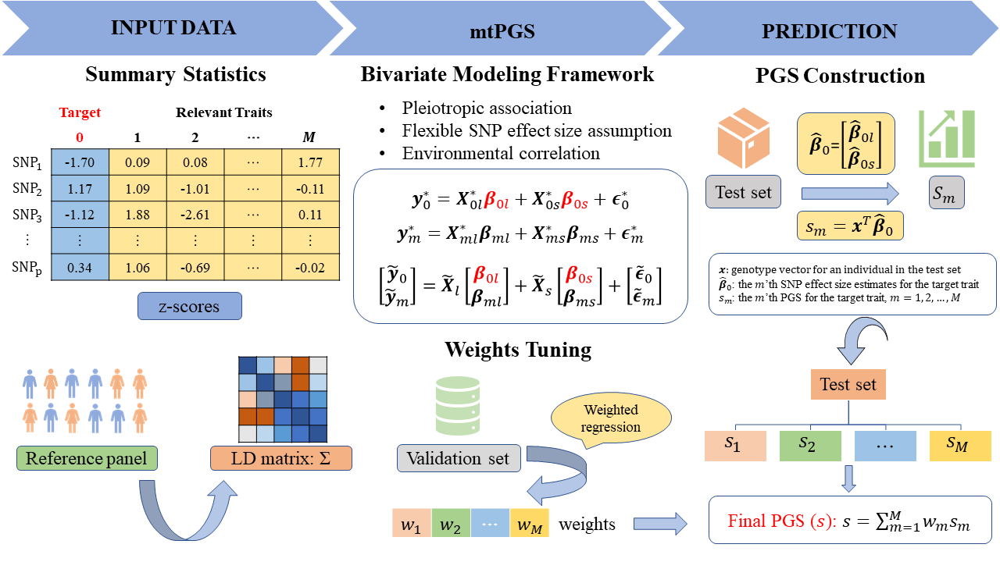

## Overview of mtPGS

mtPGS is a statistical method that leverages multiple traits to construct accurate polygenic scores (PGS) for a target trait of interest. mtPGS borrows SNP effect size similarity information between the target trait and its relevant traits to improve the effect size estimation on the target trait. In the process, mtPGS flexibly models the shared genetic architecture between the target and the relevant traits to achieve robust performance, while explicitly accounting for the environmental covariance among them to accommodate different study designs with various sample overlap patterns. In addition, mtPGS uses only summary statistics as input and relies on a deterministic algorithm with several algebraic techniques for scalable computation. mtPGS is implemented as an open-source C++ software, freely available at [www.xzlab.org/software.html](www.xzlab.org/software.html). 

### Example Analysis with mtPGS: [here](https://yuanzhongshang.github.io/GIFT/documentation/04_GIFT_Example.html).
